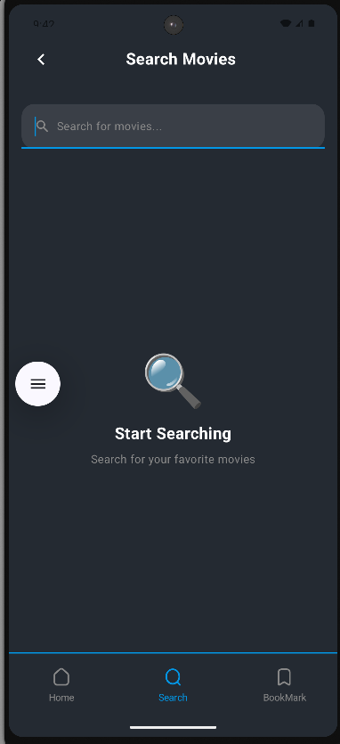
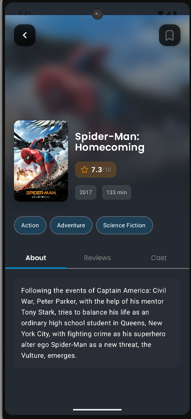
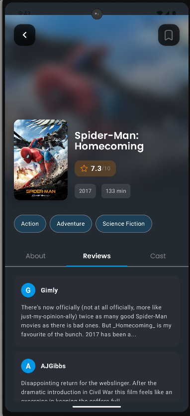
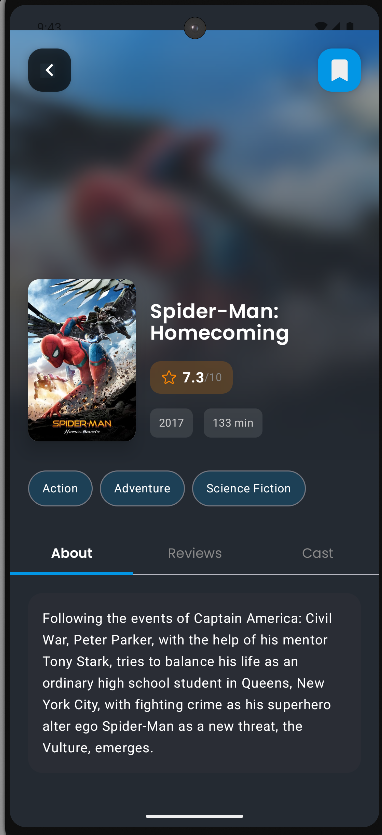

# 🎬 MovieApp

**Your Ultimate Movie Companion: Browse, Discover, and Save Your Favorite Movies!**

[](https://github.com/YOUR_USERNAME/MovieApp/stargazers)
[](https://github.com/YOUR_USERNAME/MovieApp/blob/main/LICENSE)


---

## 🌟 Overview

**MovieApp** is a modern Android application that allows users to **browse and discover top-rated movies**, including trending and popular films.  
It provides detailed information for each movie and the ability to save movies to watch later.  

---

## 🚀 Features

- 🔍 **Browse movies:** View top-rated, trending, and new releases.  
- 📽 **Movie details:**  
  - Movie title, release year, and rating  
  - **Synopsis / overview** of the movie  
  - List of **main cast and crew**  
  - Movie posters and images  
- ❤️ **Save movies to watch later** using **Room**.  
- 💾 **Offline storage:** Saved movies are available even without internet.  
- 🛠 **Modern architecture:** MVVM + Clean Architecture for maintainable code.  
- 🔧 **Dependency Injection:** Using **Hilt**.  
- 📡 **Networking:** Fetch data from APIs using **Retrofit**.  
- 🎨 **Modern UI:** Built with **Jetpack Compose** and **Material3**.

---

## 📸 Screenshots

| Home & Popular Movies | Movie Details & Favorites |
| :----------------------: | :-----------------------: |
|  |  |
|  |  |
|  |  |
|  |  |
|  | |

---

## 🛠 Tech Stack

| Category | Technologies |
| :--- | :--- |
| **Language & UI** | Kotlin, Jetpack Compose, Material3 |
| **Architecture** | MVVM + Clean Architecture |
| **Networking** | Retrofit, OkHttp |
| **Local Storage** | Room |
| **Dependency Injection** | Hilt |
| **Image Loading** | Coil |

---

## ⚙️ Requirements

- **Android Studio** (latest version)  
- Android device or emulator  
- **TMDB API Key** (must be added in `local.properties`)

---

## ▶️ How to Run

1. **Clone the repository:**
    ```bash
    git clone https://github.com/MohamedAta575/MovieApp.git
    ```

2. **Add your API Key:**
    * Create a file named **`local.properties`** in the root directory.
    * Add your TMDB API key:
        ```properties
        tmdb.api.key="YOUR_API_KEY_HERE"
        ```

3. **Run the App:**
    * Open the project in Android Studio, sync Gradle, and run it on a device or emulator.

---

## 📜 License

Distributed under the **MIT License**.  
See the [LICENSE](https://github.com/YOUR_USERNAME/MovieApp/blob/main/LICENSE) file for more information.
